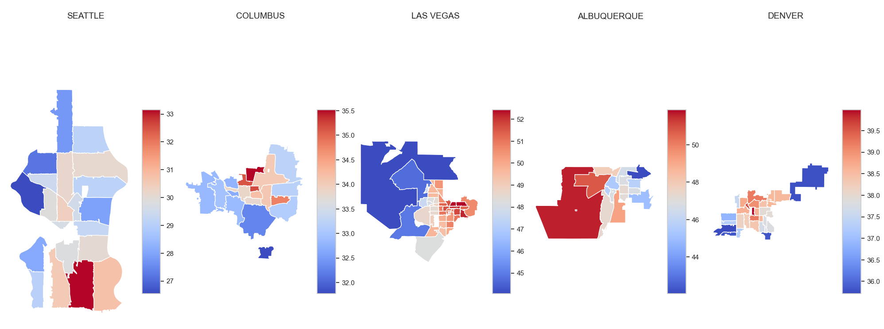

# Analyzing the Relationship Between Urban Heat Islands (UHIs) and Local Climate Factors

**Daria Oskomova**

## Executive summary
This project investigates the Urban Heat Island (UHI) effect by analyzing geospatial and climatic data to understand its drivers and recommend mitigation strategies. The dataset combines satellite-derived land surface temperature, vegetation indices, land cover data, population density, and weather metrics. Data preparation involved extracting metrics for ZIP codes, processing diverse file formats, and assembling a structured dataset for analysis.

Exploratory analysis revealed key patterns: vegetation, measured by the Normalized Difference Vegetation Index (NDVI), strongly reduces land surface temperatures, while urbanization metrics, such as high-density development and impervious surfaces, amplify heat. Seasonal trends indicated higher temperatures during summer, with Las Vegas and Albuquerque showing pronounced peaks due to their urban and climatic characteristics, while Seattle’s cooler, wetter climate moderated UHI effects. Longer day lengths were associated with increased temperatures, particularly in urbanized zones.

Modeling efforts focused on predicting UHI presence using machine learning techniques. The Random Forest model achieved the highest accuracy (90%), with vegetation, land surface temperature, and urbanization intensity emerging as the most significant predictors. Decision tree analysis further highlighted thresholds in vegetation density and urban development that influence UHI.

The findings underscore the need for increasing green spaces, reducing impervious surfaces, and adopting sustainable urban designs to mitigate UHI effects. Tailored interventions for cities based on their specific climatic and urbanization profiles can enhance resilience to UHI impacts.

## Rationale
Urban Heat Islands (UHIs) are urban areas that experience significantly higher temperatures than surrounding rural regions. Understanding their causes is crucial to addressing interconnected challenges such as public health, energy efficiency, and environmental sustainability.

## Research Question
How do urbanization characteristics and specific local climate factors (e.g., vegetation cover, building density, land use, and proximity to water bodies) contribute to the Urban Heat Island (UHI) effect across different cities?

## Data Sources
1. Land Surface Temperature: [MODIS/Terra Land Surface Temperature/Emissivity Daily L3 Global 1 km SIN Grid](https://lpdaac.usgs.gov/products/mod11a1v061/)
2. Vegetation Index: [MODIS/Terra Vegetation Indices 16-Day L3 Global 1 km SIN Grid](https://lpdaac.usgs.gov/products/mod13a2v061/)
3. Weather Data (ZIP level): [DAYMET](https://daymet.ornl.gov/getdata)
4. Wind and Atmospheric Pressure: [Meteostat](http://meteostat.net/)
5. ZIP Code Shapefile: [US Census Bureau](https://www2.census.gov/geo/tiger/TIGER2024/ZCTA520/tl_2024_us_zcta520.zip)
6. Population Density: [US Census Bureau](https://data.census.gov/table/DECENNIALDHC2020.P1?q=All%205-digit%20ZIP%20Code%20Tabulation%20Areas%20within%20United%20States%20Populations%20and%20People)
7. Land Cover and Fractional Impervious Surface: [Multi-Resolution Land Characteristics Consortium](https://www.mrlc.gov/data)

## Methodology
1. Modeling and hyperparameter tuning:
    - Classification models:
      - RandomForestClassifier
      - Support Vector Classifier (SVC)
      - K-Nearest Neighbors (KNeighborsClassifier)
    - Optimization
      - GridSearchCV with cross-validation (cv=5) was used to identify optimal hyperparameters and evaluate generalization to unseen data.

2. Feature Importance Analysis:
    - For the RandomForest model, feature importance was calculated to determine which features contributed the most to the prediction of UHI.
    - The importance scores were plotted using Seaborn to provide a visual representation of the most influential features.

5. Decision Tree Visualization:
    - A representative decision tree from the Random Forest model was visualized to demonstrate the model’s decision-making process and key feature thresholds.

## Results
Urbanization characteristics and specific local climate factors contribute significantly to the Urban Heat Island (UHI) effect in different cities:.

- Vegetation matters most. Areas with low greenery, measured by avg_ndvi, are much more likely to experience UHI. Trees and plants play a huge role in cooling urban areas.
- Urban development. High-density development (like big buildings and paved areas) is strongly linked to UHI. Open spaces with more grass and vegetation help reduce these effects.
- Hot surfaces. Land surface temperature (avg_lst_c) is a key indicator of how hot an area gets, especially in urban zones.
- Day length and weather. Longer days and calm weather (low wind speeds) can make UHI worse since there’s less opportunity for heat to dissipate.
- Forest cover. Forested areas, especially evergreen trees, are very effective at keeping temperatures lower.
- Features like rainfall, population density, and certain types of land cover (like farmland) don’t play as big of a role but still provide some context.

The findings emphasize the interplay of vegetation, urbanization, and climate in driving UHI effects. Urban planners and policymakers should focus on increasing vegetation, reducing impervious surfaces, and adopting sustainable designs to mitigate UHI, improving urban resilience to climate change.

## Next steps
1. Model deployment. Deploy the Random Forest model as a web service (e.g., Flask or FastAPI) for real-time UHI prediction.

2. Model monitoring. Track performance metrics (e.g., accuracy, recall) to identify and address potential model drift.

3. Data updates. Incorporate new data to account for evolving urbanization and climate trends.

4. Feature engineering. Explore additional predictors like surface albedo, proximity to water, or building materials.

5. Interactive visualization. Create dashboards (e.g., using Dash or Tableau) to present predictions and feature impacts to stakeholders.

6. Real-world application. Pilot the model with city planners to validate its effectiveness and refine strategies for UHI mitigation.

## Outline of project

- [Data Preparation](https://github.com/dashao/mlai/blob/main/Urban_Heat_Islands/1_uhi_data_preparation.ipynb)
- [Data Exploration](https://github.com/dashao/mlai/blob/main/Urban_Heat_Islands/2_uhi_data_exploration.ipynb)
- [Modeling](https://github.com/dashao/mlai/blob/main/Urban_Heat_Islands/3_uhi_modeling.ipynb)

### Contact and Further Information
[Email](mailto:oskomova@gmail.com)